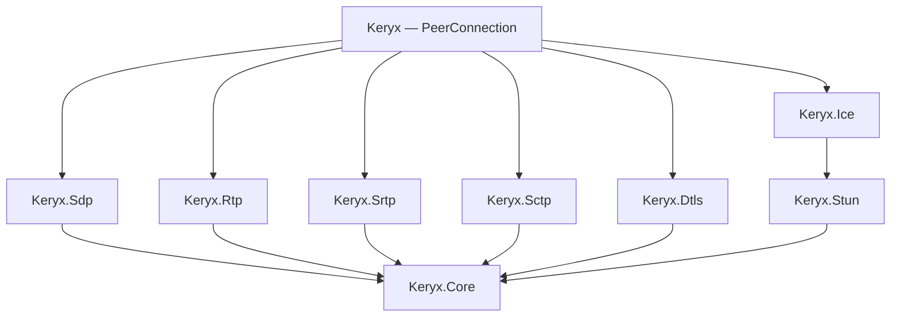

# Keryx

[](https://github.com/Proxeno/keryx/actions/workflows/ci.yml)
[](https://www.nuget.org/packages/Proxeno.Keryx)
[](https://www.nuget.org/packages/Proxeno.Keryx)
[](https://github.com/Proxeno/keryx/blob/main/LICENSE)
[](https://dotnet.microsoft.com)

**A from-scratch WebRTC stack for .NET.** No native dependencies, no third-party protocol
libraries: STUN, ICE, SDP, RTP/RTCP, DTLS 1.2, SRTP/SRTCP and SCTP are implemented in this
repository against the RFCs, with cryptographic primitives supplied exclusively by
`System.Security.Cryptography`. *Keryx* (κῆρυξ) is the Greek herald — the one who carries the
message.

> **Status: pre-release (0.x).** APIs will change. The [verification status](#verification-status)
> below states exactly what is proven today, including a real-Chrome media interop test — and the
> [honest scope](#scope-what-is-and-is-not-here) section states what is *not* here.

## Why Keryx exists

Shipping WebRTC from a .NET server has meant choosing between native wrappers and managed stacks
whose licenses or API gaps don't fit an Apache-2.0 product. Keryx is Apache-2.0 from the first
commit, and it turns the workarounds we carried in production into first-class API:

- **Typed RTCP feedback.** PLI, FIR, NACK and transport-cc arrive as dedicated events
  (`OnPictureLossIndication`, …), and `a=rtcp-fb` lines are emitted natively per configured codec —
  no SDP string-splicing between `createOffer` and `setLocalDescription`, no parsing raw RTCP
  compound packets in application code. H.264 offers `nack`, `nack pli` and `ccm fir` by default.
- **NACK-driven retransmission that actually retransmits.** Bare `a=rtcp-fb nack` is backed by a
  real RFC 4588 repair stream: an `rtx` codec, a dedicated SSRC published as `a=ssrc-group:FID`,
  and a ring of recently sent packets that inbound NACKs are served from — under a per-packet
  resend rate limit and a bandwidth budget, with counters on `GetStats()`. If the answer drops the
  `rtx` codec, retransmission is switched off rather than promised and not delivered.
- **Sender-side link quality.** Reception report blocks the browser sends are folded into
  `GetStats()` per track: fraction lost, cumulative loss, interarrival jitter and LSR/DLSR
  round-trip time — the signal a rate controller needs, without parsing RTCP yourself.
- **A codec-agnostic packetizer seam.** H.264 (packetization-mode=1, STAP-A/FU-A) and Opus ship
  in-box; community codecs implement one interface (`IRtpPayloadizer`) plus one `SdpCodec` entry.
- **Strict layering.** Each protocol layer is its own package with no upward dependencies,
  testable in isolation over in-memory transports — including lossy and reordering ones.

## Quickstart: offering H.264 to a browser

```csharp
using Keryx;

var pc = new PeerConnection(new PeerConnectionConfig
{
    StunServers = { new IPEndPoint(IPAddress.Parse("74.125.250.129"), 19302) }, // optional
});

// Channels created before negotiation are DCEP-opened once SCTP associates.
var controller = pc.CreateDataChannel("controller", ordered: false, maxRetransmits: 0);
pc.OnPictureLossIndication += (_, e) => encoder.RequestKeyframe();

var offerSdp = await pc.CreateOfferAsync(ct);                       // -> to the browser
await pc.SetRemoteDescriptionAsync(answerSdp, SdpType.Answer, ct);  // <- browser's answer
pc.AddIceCandidate(candidate, sdpMid);                              // <- trickled candidates
await pc.WaitForConnectedAsync(TimeSpan.FromSeconds(15), ct);

pc.SendVideoFrame(annexBAccessUnit, rtpTimestamp90k);   // one H.264 access unit per call
pc.SendAudioFrame(opusPacket, rtpTimestamp48k);
(await controller).OnMessage += (isBinary, payload) => HandleInput(payload);

// Inbound NACKs are served from the send history as RTX automatically; read the link back:
var video = pc.GetStats().Video;
var lost = video?.Quality?.FractionLost;              // 0..1, from the peer's reception reports
var rtt = video?.Quality?.RoundTripTime;              // RFC 3550 LSR/DLSR arithmetic
var resent = video?.Retransmission?.PacketsRetransmitted;
```

That is the whole surface a sendonly media server needs: ICE gathering, DTLS with fingerprint
pinning, SRTP keying, SCTP data channels and RTCP loops all run behind those calls.

## Architecture



At runtime everything multiplexes over one UDP socket (BUNDLE + rtcp-mux): ICE consumes STUN,
DTLS records (first byte 20–63) carry SCTP, and SRTP/SRTCP (128–191) carry media — see
[docs/architecture.md](docs/architecture.md) for the wire-path diagram and design rules, and
[docs/layers/](docs/layers) for per-layer design notes.

## Packages

| Package | Contents |
| --- | --- |
| `Keryx` | Composition root: the `PeerConnection` API. Reference this to get the whole stack. |
| `Keryx.Core` | Binary readers/writers, the `IDatagramTransport` seam, logging abstraction. |
| `Keryx.Stun` | STUN (RFC 5389) messages and client. |
| `Keryx.Sdp` | Lossless SDP model, JSEP offer builder, answer negotiator. |
| `Keryx.Rtp` | RTP, RTCP with typed feedback, H.264/Opus packetizers, `IRtpPayloadizer`. |
| `Keryx.Dtls` | DTLS 1.2 handshake + record layer, DTLS-SRTP keying export. |
| `Keryx.Srtp` | SRTP/SRTCP: AES-CM + HMAC-SHA1-80 and AEAD AES-GCM. |
| `Keryx.Ice` | ICE agent (RFC 8445 subset, dual-stack IPv4/IPv6, aggressive nomination). |
| `Keryx.Turn` | TURN client: relay allocations, permissions, channel binding (RFC 8656). |
| `Keryx.Sctp` | SCTP over DTLS, DCEP data channels, partial reliability. |

## Verification status

Every claim is backed by a test in this repository.

- [x] **RFC test vectors** — STUN: all four RFC 5769 vectors, byte-exact both directions ·
      SRTP: RFC 3711 B.2 keystream + B.3 key derivation, RFC 7714 §16/§17 GCM ·
      SCTP: CRC32c check vectors · RTP: header edge-case matrix, RFC 6184 golden packets.
- [x] **Loopback integration** — two `PeerConnection`s over real UDP sockets: ICE connects, DTLS
      completes with mutual fingerprint pinning, 30 real H.264 access units arrive byte-identical,
      data channels round-trip (including 64 KB binary), PLI/FIR arrive as typed events, and a
      Generic NACK is answered with RFC 4588 RTX packets on the repair SSRC.
- [x] **Loss sweeps** — a seeded fault injector splices in under the sender's SRTP through
      `PeerConnectionConfig.TransportInterceptor` and drops, duplicates, reorders and delays media
      datagrams while STUN, DTLS and RTCP pass through untouched. At 1%, 5% and 15% uniform loss,
      and under ten-packet bursts, **every packet the receiver could detect as missing comes back**;
      with retransmission switched off at the same seeds, exactly those packets stay lost
      (2098-packet stream: 19 / 113 / 314 permanent holes).
- [x] **Chrome interop** — headless Chrome (tested with 151) answers a Keryx offer over HTTP
      signaling: ICE connects, DTLS completes (Keryx as server, `SRTP_AES128_CM_HMAC_SHA1_80`),
      **Chrome decodes and renders the H.264 Keryx sends** (60+ frames, 640×360, keyframes
      counted, video element playing) and both data channels echo. A second session runs the same
      fifteen seconds twice across a 5% lossy link: with RFC 4588 retransmission Chrome NACKs,
      accepts 79 of 80 destroyed packets back as repairs and decodes **433 frames at 29 fps with no
      freezes**; without it, the same seed leaves 51 frames at 15 fps and five freezes. Run them
      locally with `dotnet test tests/Keryx.IntegrationTests --filter "Category=ChromeInterop"`.
- [x] **Soak** — five minutes of 30 fps video across a 5% lossy, reordering link: 31,815 packets,
      1,564 repaired, zero holes, zero history misses, and a managed heap that ends 0.9% *below*
      where it started (`--filter "Category=Soak"`).
- [x] **Benchmarks** — Keryx's own measured baseline; see below.

885 tests across ten projects (`dotnet test Keryx.slnx`), plus the trait-gated Chrome interop and
soak suites.

## Benchmarks

BenchmarkDotNet 0.15.8 (default job), Apple M5 Max / macOS 26.6 / .NET 10.0.11 arm64, run
2026-08-21. Measured, absolute numbers — no marketing rounding.

| Benchmark | Keryx | Allocated |
| --- | ---: | ---: |
| H.264 packetization, 25 KB access unit @ MTU 1200 | **0.85 μs** | 0 B |
| RTP header write + parse (12-byte header) | **2.6 ns** | 0 B |
| SDP: generate full offer | 1.9 μs | 19.4 KB |
| SDP: parse Chrome answer | 2.6 μs | 25.7 KB |
| SRTP protect 1200-byte packet (AES-CM/SHA1-80) | **1.1 μs** | 0 B |

Zero allocation on the hot RTP / SRTP / packetization paths is a design goal; the SDP paths
allocate the document they build or parse and are not on the per-packet path.

## RFC coverage

| RFC | What | Where tested |
| --- | --- | --- |
| 5389 (+5769 vectors) | STUN, MESSAGE-INTEGRITY/FINGERPRINT dummy-length rule | `Keryx.Stun.Tests` |
| 8445 | ICE: pair priority, checks, role conflict, prflx, nomination | `Keryx.Ice.Tests` |
| 4566 / 8829 (subset) | SDP model, JSEP offer/answer | `Keryx.Sdp.Tests` |
| 3550 | RTP header, SR/RR/SDES/BYE, NTP mapping | `Keryx.Rtp.Tests` |
| 4585 / 5104 | PLI, FIR, GenericNack (PID/BLP), REMB parse | `Keryx.Rtp.Tests` |
| draft-holmer-rmcat-transport-wide-cc-01 | transport-cc feedback parse/build | `Keryx.Rtp.Tests` |
| 6184 / 7587 / 8285 | H.264 STAP-A/FU-A, Opus, header extensions | `Keryx.Rtp.Tests` |
| 4588 / 5576 | RTX packet format (OSN, own seq space), `apt`, `ssrc-group:FID` | `Keryx.Rtp.Tests`, `Keryx.Sdp.Tests`, `Keryx.IntegrationTests` |
| 3711 (B.2, B.3) / 7714 (§16, §17) | SRTP/SRTCP AES-CM + GCM, ROC, replay | `Keryx.Srtp.Tests` |
| 5764 §4.2 | DTLS-SRTP key split, use_srtp | `Keryx.Srtp.Tests`, `Keryx.Dtls.Tests` |
| 6347 / 5246 / 5288 / 7627 / 5705 | DTLS 1.2 records, PRF vectors, AES-GCM, EMS, exporter | `Keryx.Dtls.Tests` |
| 9260 / 3758 / 8831 / 8832 | SCTP, FORWARD-TSN, data channels, DCEP | `Keryx.Sctp.Tests` |
| 7983 / 5761 | Demux on the bundled transport | `Keryx.Rtp.Tests`, `Keryx.IntegrationTests` |

## Scope: what is and is not here

**Implemented:** the offerer-side media server path end to end — sendonly H.264 + Opus with
BUNDLE/rtcp-mux, trickle ICE (in and out), DTLS 1.2 both roles with fingerprint pinning, SRTP
AES-CM and AES-GCM, bidirectional data channels with partial reliability, typed RTCP feedback
in both directions, RFC 4588 RTX retransmission driven by inbound NACKs, sender-side loss/jitter/RTT
statistics from reception reports, a minimal recvonly answerer, and a raw RTP receive surface. Recent additions: `a=extmap` with outbound transport-wide-cc (TWCC) sequence numbers; TURN relay-candidate gathering (allocations, permissions, channel binding); and dual-stack IPv6 host / server-reflexive gathering with address-family-correct pairing.

**Experimental (compiles and is tested, but not yet a production path):** a send-side GCC
bandwidth estimator and pacer (in `Keryx.Rtp`, not yet wired into the send loop), and simulcast
transport primitives (RID / `a=simulcast` negotiation and ingest demux are complete; per-subscriber
forwarding is scaffolded).

**Not implemented (yet, honestly):** ULPFEC and RED, REMB generation, regular (non-aggressive)
nomination, renegotiation and ICE restart, IPv6 *relay* allocation, SCTP stream reset (RE-CONFIG),
jitter buffering on the receive surface, audio receive processing. Per-layer simplifications are
documented in [docs/layers/](docs/layers).

## Security

The DTLS and SRTP implementations verify everything the RFCs require — peer CertificateVerify
over the transcript, Finished verify_data, fingerprint pinning against the SDP `a=fingerprint`,
auth tags, anti-replay windows — and those checks are covered by tamper/replay tests. They have
**not yet received an independent security review**; do not protect sensitive production traffic
with them until they have. Primitives are the platform's, never hand-rolled. Details and
reporting: [SECURITY.md](SECURITY.md).

## Contributing

See [CONTRIBUTING.md](CONTRIBUTING.md). The short version: layering is law, zero NuGet
dependencies in `src/`, warnings are errors, wire parsers never throw on hostile input, and
protocol claims cite their RFC section.

Repository social preview: upload `docs/assets/social-preview.jpg` in the GitHub repository
settings (Settings → General → Social preview) — it cannot be set from the repository itself.

## License

Apache-2.0. See [LICENSE](LICENSE). © Keryx contributors.
