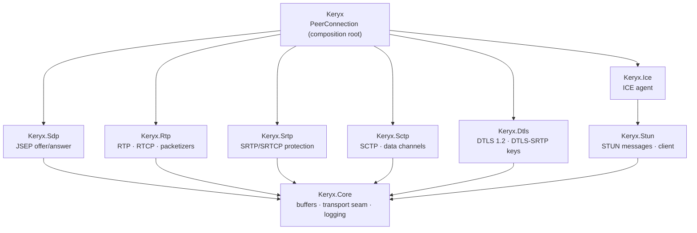
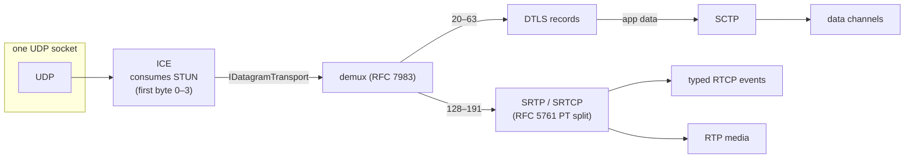

# Keryx architecture

Keryx is a strictly layered stack. Every protocol layer is its own assembly and NuGet package,
depends only on `Keryx.Core` (and `Keryx.Ice` on `Keryx.Stun`), and is testable in isolation.
The `Keryx` package is the composition root that wires them into an `RTCPeerConnection`-style API.

## The wire path

At runtime the layers stack differently than the compile-time graph — everything multiplexes over
one UDP socket owned by the ICE agent (BUNDLE + rtcp-mux):

The seam between layers is `Keryx.Core.IDatagramTransport`: an unreliable, message-oriented,
bidirectional pipe. ICE exposes its selected candidate pair as one; DTLS consumes one and exposes
another (its decrypted application-data stream) to SCTP. This is what makes each layer testable
alone — the test suites drive DTLS and SCTP over in-memory transport doubles, including lossy and
reordering variants.

## Design rules

1. **No upward dependencies, no side dependencies** (single exception: `Keryx.Ice -> Keryx.Stun`).
   SRTP does not reference RTP; it parses the 12-byte fixed header itself, because SRTP is a
   transform over wire bytes, not a media layer.
2. **Zero NuGet dependencies in shipping libraries.** The BCL is the only platform. Cryptographic
   primitives come from `System.Security.Cryptography`; hand-rolled ciphers are forbidden.
   Test projects may use xunit / FluentAssertions.
3. **Wire parsing never throws on hostile input.** Truncation surfaces as `ByteBufferException`
   from the shared readers and is translated into a clean rejection (`TryParse` returning false,
   a dropped packet, a logged warning) at the protocol boundary.
4. **Typed events over raw packets.** The API exposes what the application means to consume —
   `OnPictureLossIndication`, not an RTCP compound packet to grep through.

See `docs/layers/` for per-layer design notes and the simplifications each layer currently makes.
